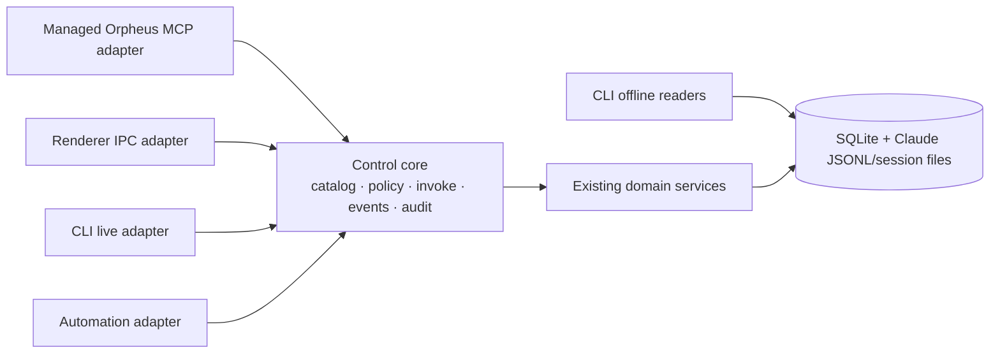

# Orpheus Agentic Control Plane

**Status:** durable product and migration concept 
**Scope:** local Orpheus app, its renderer, bundled CLI, managed Claude sessions, and future durable automations

The Agentic Control Plane makes Orpheus programmable through stable, semantic
capabilities while keeping the app local-first. MCP is the primary discovery
surface for agents; the renderer, CLI, and automation engine are adapters over
the same control core.

This is an additive design. The existing CLI remains supported, including its
direct SQLite and JSONL reads while the app is offline. There is no deletion,
deprecation, or “Phase F removal” phase in this plan.

See [architecture.md](architecture.md) for boundaries, adapter contracts,
security, migration rules, and decision records;
[identity-and-permissions.md](identity-and-permissions.md) defines trusted
runtime identity, target resolution, grants, permission capabilities, and risk
tiers.

## Product promise

An Orpheus-managed agent can discover what Orpheus can do, identify its own
workspace, observe relevant state, and ask Orpheus to perform bounded domain
operations without clicking UI controls, guessing coordinates, or scripting
terminal keystrokes as its primary interface.

The control plane must:

- preserve local ownership of projects, transcripts, settings, and audit data;
- expose one semantic capability model to MCP, renderer, CLI, and automations;
- keep read-only CLI commands useful when Orpheus is not running;
- preserve existing CLI commands and machine-readable output;
- enforce identity, project scope, self-protection, and fan-out guardrails in
  the core rather than independently in each adapter;
- make mutations auditable and reads explicit about source and freshness;
- migrate capability-by-capability without a flag day.

## Current-state inventory

This inventory describes the current repository, not the June 2026 design
snapshot.

| Area | Current state | Current paths |
| --- | --- | --- |
| Bundled CLI | Exists, with workspace/project lifecycle, read, wait, send, reviews, and agent-facing help/schema commands | `packages/orpheus-cli/src/`, `resources/bin/orpheus` |
| Offline reads | Exists; opens SQLite read-only and parses Claude JSONL/session files without launching the app | `packages/orpheus-cli/src/reads/db.ts`, `reads/transcript.ts`, `reads/session-status.ts` |
| Live CLI transport | Exists; authenticated HTTP over `cmd.sock`, with request/response and status subscriptions | `src/main/commandServer.ts`, `packages/orpheus-cli/src/socket-client.ts` |
| Quick Actions | Exists as a separate in-process registry used by renderer IPC; descriptors currently expose only id/kind externally | `src/main/actions/registry.ts`, `actions/index.ts`, `ipc/actions.ts`, `src/preload/index.ts` |
| Audit trail | Exists for Quick Action mutators | `src/main/actions/audit.ts`, `src/main/db/schema.ts` |
| Domain state | Projects, workspaces, lineage, worktrees, sessions, and declarative SQLite migrations exist | `src/main/projects.ts`, `workspaces.ts`, `worktrees.ts`, `sessions.ts`, `db/` |
| Activity/transcripts | File-authoritative Claude status and JSONL-derived session reads exist | `src/main/sessionState.ts`, `sessionStatusMap.ts`, `sessions.ts`, `actions/session.ts` |
| Home dashboard | Exists with Overview, Limits, and Insights views over account-wide GitHub work, provider usage, Claude activity windows, recent sessions, model activity, and GitHub contribution windows | `src/renderer/src/components/dashboard/DashboardView.tsx`, `dashboard/dashboard-home/` |
| Dashboard data services | Typed renderer IPC and main-process domain modules provide GitHub account snapshots, provider-neutral usage, activity/contribution windows, persisted stale-while-revalidate caches, and background pushes | `src/shared/ipc.ts`, `src/main/githubDashboard.ts`, `providerUsage.ts`, `claudeActivityWindow.ts`, `db/dashboardCache.ts`, `usagePoller.ts` |
| Review/workbench | Diff viewing and local review comments exist | `src/main/gitDiff.ts`, `reviewStore.ts`, `ipc/reviews.ts`, `src/renderer/src/components/workbench/` |
| Panes | Persisted panel/layout/terminal hierarchy and native surfaces exist | `src/main/paneStore.ts`, `ipc/panes.ts`, `src/renderer/src/components/panes/` |
| MCP | Orpheus can manage Claude MCP configuration, but does not yet ship an Orpheus control MCP server | `src/main/mcp.ts`, `ipc/mcp.ts`, `ClaudeToolsSection.tsx` |
| Automations | No durable control-plane automation engine exists | — |

The principal architectural gap is split authority: the CLI command dispatch in
`src/main/commandServer.ts`, Quick Actions in `src/main/actions/registry.ts`, and
typed dashboard IPC/domain modules are independent surfaces. They are migration
inputs, not yet a complete, transport-neutral, self-describing control contract.
The dashboard surfaces are not automatically agent-visible: Phase 2 explicitly
defers account-wide GitHub, provider-usage, and all-history activity publication
until their scope, freshness, refresh effects, and permissions are modeled.

### Legacy design-document status

These historical inputs remain useful for intent, but are not current
implementation specifications:

- `docs/superpowers/specs/2026-06-28-orpheus-feature-landscape-design.md`
- `docs/plans/2026-06-30-001-feat-orpheus-cli-plan.md`

They predate the shipped CLI, worktrees, diff/review UI, declarative
`src/main/db/` migration engine, and current workbench/panes architecture. In
particular, references to a monolithic `src/main/db.ts`, an absent CLI, absent
worktrees, and an absent diff viewer are stale. Their still-valid ideas are
local-first control, transcript-backed observation, bounded fan-out, and an
Orpheus MCP surface.

## Terminology

| Term | Meaning |
| --- | --- |
| Control plane | The in-process authority that describes, authorizes, invokes, audits, and observes Orpheus capabilities |
| Operation | A stable semantic invocation such as the compatibility ids `reviews.list` and `reviews.setResolved` |
| Permission capability | A versioned authority such as `workspaces.create`, `workspaces.wait`, or `reviews.resolve`, defined by the identity/permissions design |
| Adapter | A consumer-specific translation layer: MCP, renderer IPC, CLI live transport, or automation |
| Principal | The caller identity: renderer user, workspace agent, CLI process, or automation run |
| Source account | A GitHub or provider account whose data Orpheus reads; account labels are result metadata, not caller identity or authorization |
| Execution context | Principal plus workspace/project scope, consumer, request id, and granted policy |
| Offline read | A read directly from SQLite or Claude-owned files that does not require the app |
| Semantic control | Intent expressed in Orpheus domain terms, not pointer events, DOM selectors, coordinates, or generic key simulation |
| Automation | A persisted trigger plus semantic control-plane invocation, policy, limits, and run history |

## Goals

- Zero-configuration Orpheus tool discovery inside managed Claude sessions.
- A single operation catalog and invocation path for every live adapter.
- Self identity and safe project-scoped observation before mutation.
- Semantic orchestration of workspaces, reviews, workbench, panes, and settings.
- Durable, bounded automations built on the same policies and audit model.
- Honest compatibility: old and new surfaces may coexist indefinitely.

## Non-goals

- Replacing the embedded Claude terminal or libghostty.
- Replacing the CLI with MCP.
- Removing direct/offline CLI reads.
- Exposing arbitrary renderer clicks, DOM access, screenshots, or macOS
  accessibility scripting as control-plane capabilities.
- Treating raw `terminal.sendKeys` as the normal agent API.
- Providing remote/cloud multi-user orchestration in the first design.
- Editing auth secrets through agents or automations.
- Inventing textual terminal output where no authoritative stream exists; an
  unavailable observation is preferable to OCR or simulated scraping.

## Architecture at a glance

MCP is the primary agent discovery surface, not the only control surface. The
CLI remains the primary shell and offline-read surface. Renderer IPC remains
the native UI adapter. Automations invoke the core in-process.

## Additive delivery phases

1. **Control Foundation** — add the canonical operation catalog, invocation
   context, policy checks, results, events, and audit contract. Adapt existing
   Quick Actions and command-server actions incrementally.
2. **Self Identity + Read-only MCP** — bundle a managed MCP adapter and expose
   `self.get` under `identity.read`, plus `projects.read`, `workspaces.read`,
   `reviews.read`, and operation descriptions. Managed launch-time
   `--mcp-config` is the preferred direction and must not mutate user/global
   `.mcp.json`; the exact launch mechanism remains subject to implementation
   verification. Account-wide Home dashboard reads and active source refreshes
   remain renderer-only compatibility surfaces in this phase.
3. **Workspace Orchestration** — expose semantic create/start/wait/send/close/
   archive operations with lineage, same-project defaults, self-action guards,
   background activation, and fan-out limits.
4. **Self Workbench/Panes Control** — let an agent control its own workbench and
   pane/layout state through domain commands such as open file, show diff,
   select layout, and start/stop a configured terminal. Do not expose click
   simulation.
5. **Terminal Observability** — expose authoritative lifecycle, readiness,
   command/cwd, status, transcript, and output-tail data where it exists.
   Return explicit unsupported/unavailable states where it does not.
6. **Settings/Resources** — add scoped, allowlisted reads and safe writes for
   non-secret settings and resources, preserving layered composition and
   restart-to-apply semantics.
7. **Durable Automations** — persist triggers, semantic invocations, policy,
   budgets, retries, idempotency keys, and run history; execute through the
   same control core.
8. **Integrated Validation** — verify parity across MCP, renderer, CLI,
   automation, offline reads, restart recovery, policy failures, and audit
   records.

Each phase lands usable additions. Existing CLI commands, `/cmd`, renderer APIs,
and offline readers continue to work. There is no later removal/deprecation
phase.

## Completion criteria

The concept is realized when:

- a managed workspace discovers Orpheus tools through MCP without prompt
  documentation or manual configuration;
- an operation has one descriptor, validation contract, permission/policy path,
  handler, and result model regardless of adapter;
- renderer, CLI, MCP, and automation parity is testable from the catalog;
- read-only CLI behavior is verified with the app stopped;
- agents can orchestrate semantically without relying on UI clicks or raw
  terminal key simulation;
- all mutations identify their principal and produce redacted audit records;
- no compatibility or deletion phase is required to call the migration done.
