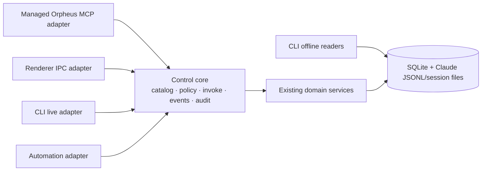

# Orpheus Agentic Control Plane

**Status:** Phases 1–8 implemented. A fresh 2026-07-28 packaged build confirms
the 48-tool catalog, the positive self-workspace pane create/observe/delete
flow, and one Settings automation no-op round-trip save. Earlier packaged evidence covers
Phase 3 background open, broader Phase 4 controls, Phase 6 reads/patch, and
Phase 7–8 fixture recovery. Unlisted negative and recovery paths remain
pending. 
**Scope:** local Orpheus app, its renderer, bundled CLI, managed Claude sessions, and durable automations

The Agentic Control Plane makes Orpheus programmable through stable, semantic
capabilities while keeping the app local-first. MCP is the primary discovery
surface for agents; the renderer, CLI, and automation engine are adapters over
the same control core.

This is an additive design. The existing CLI remains supported, including its
direct SQLite and JSONL reads while the app is offline. There is no deletion,
deprecation, or compatibility-removal phase in this plan.

### 2026-07-28 current-source delta

- A valid, current, main-observed managed Claude runtime receives the complete
  registered runtime permission vocabulary. Pending, dead, rotated, revoked, or
  mismatched identities fail closed.
- Settings → Orpheus Agent Tools is a persisted, deny-only exposure layer over
  MCP categories and individual tools. It cannot grant authority beyond runtime
  identity, risk, target, or exact resource-scope policy.
- Effective catalog changes are revisioned. A connected MCP bridge long-polls
  for changes, advertises `tools.listChanged`, and refreshes `tools/list`
  without a workspace or MCP restart.
- Before the automation-management descriptors landed, the all-enabled
  deterministic catalog snapshot contained 37 of 37 MCP-eligible descriptors.
  The post-pane-lifecycle 2026-07-28 harness snapshot reports 48 registered, 48
  MCP, 48 default-exposed, 48 in the explicit Phase 4–6 scope, and 2
  automation-eligible operations. These dated counts are verification evidence,
  not a normative catalog contract.
- `reviews.setResolved` is now a scoped Tier 2 MCP mutation with target
  revalidation and redacted audit records.
- Ghostty exposes a bounded authoritative screen/scrollback tail. Source and
  deterministic coverage pass. The fresh packaged pane flow returned its
  RED/GREEN output through `terminals.getOutputTail`; truncation and
  unavailable-provider paths remain deterministic-only.
- Production renderer IPC/preload and nine MCP-only `automations.*` management
  operations now cover catalog/list/get/create/update/enable/delete, run
  history, and manual retry generations. MCP management is restricted to the
  caller's exact bound workspace and is never automation-eligible. Settings →
  Automations is source-complete for definition editing, explicit
  enable/delete/retry confirmations, and redacted run history. The fresh
  packaged pass selected an existing MCP-created project-descriptor/workspace
  definition and performed a no-op round-trip Save: its scope remained
  `Workspace` and its revision advanced. Material field edits and the remaining
  management flows are pending.
- Source now includes two constrained Tier 3 pane lifecycle descriptors:
  `panes.createWorkspaceTerminal` creates one durable terminal rooted at the
  trusted self workspace, and `panes.deleteTerminalLayout` removes only that
  exact agent-owned single-leaf layout with dual CAS and staged native teardown.
  Creation is capped at four layouts per owner and 12 terminals globally in
  `General`. An optional one-shot initial command is never persisted, is
  attempted at most once, and cannot replay. Deterministic verification passes;
  the fresh packaged pass created two layouts, observed one directly, and
  deleted both through exact dual CAS. Material trusted-UI edits transfer
  ownership, while owner-workspace close/archive/removal tears down all live
  still-owned surfaces so no process survives lease revocation.

### 2026-07-28 packaged-live evidence

A fresh Orpheus Dev build installed and launched with 48 managed MCP tools
visible. `panes.createWorkspaceTerminal` rendered RED/GREEN command output and
an interactive zsh at normal Retina scale. Its returned `observationTarget`
worked unchanged with `terminals.getOutputTail`. Exact dual-CAS deletion
succeeded for both QA layouts; deleted pane targets then returned `not_found`,
while the workspace Claude terminal remained available. Settings → Automations
also round-tripped an existing MCP-created project-descriptor/workspace
definition through a no-op Save: its scope remained `Workspace` and its revision
advanced.

Orpheus adds no per-call approval gate: valid live runtimes receive the
default-exposed catalog, subject to deny-only Agent Tools settings and normal
scope/policy checks. Claude Code may still show its own MCP tool approval prompt
according to Claude's permission mode; that prompt is not an Orpheus exposure
permission.

Tool-exposure refresh is independent of Phase 6 launch settings:
model/effort patches still report `restartRequired` through the existing
workspace dirty/restart-to-apply contract.

See [architecture.md](architecture.md) for boundaries, adapter contracts,
security, migration rules, and decision records;
[identity-and-permissions.md](identity-and-permissions.md) defines trusted
runtime identity, target resolution, grants, permission capabilities, and risk
tiers. Delivered phase records:
[Phase 1: Control Foundation](phase-01-control-foundation.md) and
[Phase 2: Self Identity + Read-only MCP](phase-02-self-identity-readonly-mcp.md).
The delivered Phase 3 record is split between
[Workspace Orchestration](phase-03-workspace-orchestration.md) and its
[strict interfaces](phase-03-interfaces.md). Phase 4 is recorded in
[Workbench and Pane Control](phase-04-workbench-pane-control.md) and its
[strict interfaces](phase-04-interfaces.md). Phase 5's independently reviewable
[Terminal Observability](phase-05-terminal-observability.md) slice is
implemented and deterministically tested. A packaged pane run exposed an exact
scoped-observation defect; the repaired exact layout/surface path now passes
targeted boundary checks and rebuilt live managed-MCP validation. Phase 6 is recorded in
[Settings and Resources](phase-06-settings-resources.md) and its
[strict interfaces](phase-06-interfaces.md). Phase 7 is recorded in
[Durable Automations](phase-07-durable-automations.md), and the cross-phase
evidence boundary is tracked in
[Phase 8: Integrated Validation](roadmap.md#8-integrated-validation).

## Product promise

An Orpheus-managed agent can discover what Orpheus can do, identify its own
workspace, observe relevant state, and ask Orpheus to perform bounded domain
operations without clicking UI controls, guessing coordinates, or scripting
terminal keystrokes as its primary interface.

The control plane must:

- preserve local ownership of projects, transcripts, settings, and audit data;
- expose one semantic capability model to MCP, renderer, CLI, and automations;
- keep read-only CLI commands useful when Orpheus is not running;
- preserve existing CLI commands and machine-readable output;
- enforce identity, project scope, self-protection, and fan-out guardrails in
  the core rather than independently in each adapter;
- make mutations auditable and reads explicit about source and freshness;
- migrate capability-by-capability without a flag day.

## Current-state inventory

This inventory describes the current repository, not the June 2026 design
snapshot.

| Area                    | Current state                                                                                                                                                                                                                                                                                                                                                                                                                                                                                                               | Current paths                                                                                                                                                                                                                                        |
| ----------------------- | --------------------------------------------------------------------------------------------------------------------------------------------------------------------------------------------------------------------------------------------------------------------------------------------------------------------------------------------------------------------------------------------------------------------------------------------------------------------------------------------------------------------------- | ---------------------------------------------------------------------------------------------------------------------------------------------------------------------------------------------------------------------------------------------------- |
| Bundled CLI             | Exists, with workspace/project lifecycle, read, wait, send, reviews, and agent-facing help/schema commands                                                                                                                                                                                                                                                                                                                                                                                                                  | `packages/orpheus-cli/src/`, `resources/bin/orpheus`                                                                                                                                                                                                 |
| Offline reads           | Exists; opens SQLite read-only and parses Claude JSONL/session files without launching the app                                                                                                                                                                                                                                                                                                                                                                                                                              | `packages/orpheus-cli/src/reads/db.ts`, `reads/transcript.ts`, `reads/session-status.ts`                                                                                                                                                             |
| Live CLI transport      | Exists; authenticated HTTP over `cmd.sock`, with request/response and status subscriptions                                                                                                                                                                                                                                                                                                                                                                                                                                  | `src/main/commandServer.ts`, `packages/orpheus-cli/src/socket-client.ts`                                                                                                                                                                             |
| Quick Actions           | Exists as a separate in-process registry used by renderer IPC; descriptors currently expose only id/kind externally                                                                                                                                                                                                                                                                                                                                                                                                         | `src/main/actions/registry.ts`, `actions/index.ts`, `ipc/actions.ts`, `src/preload/index.ts`                                                                                                                                                         |
| Audit trail             | Exists for Quick Action mutators                                                                                                                                                                                                                                                                                                                                                                                                                                                                                            | `src/main/actions/audit.ts`, `src/main/db/schema.ts`                                                                                                                                                                                                 |
| Domain state            | Projects, workspaces, lineage, worktrees, sessions, and declarative SQLite migrations exist                                                                                                                                                                                                                                                                                                                                                                                                                                 | `src/main/projects.ts`, `workspaces.ts`, `worktrees.ts`, `sessions.ts`, `db/`                                                                                                                                                                        |
| Activity/transcripts    | File-authoritative Claude status and JSONL-derived session reads exist                                                                                                                                                                                                                                                                                                                                                                                                                                                      | `src/main/sessionState.ts`, `sessionStatusMap.ts`, `sessions.ts`, `actions/session.ts`                                                                                                                                                               |
| Home dashboard          | Exists with Overview, Limits, and Insights views over account-wide GitHub work, provider usage, Claude activity windows, recent sessions, model activity, and GitHub contribution windows                                                                                                                                                                                                                                                                                                                                   | `src/renderer/src/components/dashboard/DashboardView.tsx`, `dashboard/dashboard-home/`                                                                                                                                                               |
| Dashboard data services | Typed renderer IPC and main-process domain modules provide GitHub account snapshots, provider-neutral usage, activity/contribution windows, persisted stale-while-revalidate caches, and background pushes                                                                                                                                                                                                                                                                                                                  | `src/shared/ipc.ts`, `src/main/githubDashboard.ts`, `providerUsage.ts`, `claudeActivityWindow.ts`, `db/dashboardCache.ts`, `usagePoller.ts`                                                                                                          |
| Review/workbench        | Diff viewing and local review comments exist                                                                                                                                                                                                                                                                                                                                                                                                                                                                                | `src/main/gitDiff.ts`, `reviewStore.ts`, `ipc/reviews.ts`, `src/renderer/src/components/workbench/`                                                                                                                                                  |
| Panes                   | Persisted panel/layout/terminal hierarchy and native surfaces exist. Two semantic operations constrain self-workspace creation and exact-owner single-layout deletion; deterministic validation and the positive packaged create/observe/delete path pass.                                                                                                                                                                                                                                                                  | `src/main/paneStore.ts`, `src/main/controlPlane/workbenchCapabilities.ts`, `src/renderer/src/components/panes/`                                                                                                                                      |
| MCP                     | A bundled stdio bridge and runtime-lease-scoped `/control` protocol are implemented. Valid current managed runtimes receive the registered permission vocabulary; Settings can only suppress MCP exposure. Revisioned `tools/listChanged` refresh updates connected bridges without restart                                                                                                                                                                                                                                 | `packages/orpheus-mcp/`, `src/main/controlPlane/`, `src/main/commandServer.ts`                                                                                                                                                                       |
| Automations             | Durable bounded schedules/events invoke the canonical registry in-process. Two effect-free Phase 6 reads retain fixed Tier 0 exact-scope automation grants. Renderer IPC/preload, Settings → Automations, and nine MCP-only exact-bound-workspace operations support definitions, state, runs, and manual retry generations; MCP management is never automation-eligible. A packaged no-op definition Save retained Workspace scope and advanced revision; material field edits and remaining management paths are pending. | `src/main/automations/`, `src/main/ipc/automations.ts`, `src/main/controlPlane/automationManagementCapabilities.ts`, `src/main/controlPlane/safeAutomationGrants.ts`, `src/renderer/src/components/dashboard/settings/OrpheusAutomationsSection.tsx` |

The control registry is now authoritative for the Phase 1 review proof, the
Phase 2 managed read catalog, and Phase 3 workspace orchestration. Split
authority remains for Quick Actions, dashboard IPC/domain modules, and later
domains; those surfaces are migration inputs rather than automatically
published agent capabilities.
The dashboard surfaces are not automatically agent-visible: Phase 2 explicitly
defers account-wide GitHub, provider-usage, and all-history activity publication
until their scope, freshness, refresh effects, and permissions are modeled.

### Legacy design-document status

These historical inputs remain useful for intent, but are not current
implementation specifications:

- `docs/superpowers/specs/2026-06-28-orpheus-feature-landscape-design.md`
- `docs/plans/2026-06-30-001-feat-orpheus-cli-plan.md`

They predate the shipped CLI, worktrees, diff/review UI, declarative
`src/main/db/` migration engine, and current workbench/panes architecture. In
particular, references to a monolithic `src/main/db.ts`, an absent CLI, absent
worktrees, and an absent diff viewer are stale. Their still-valid ideas are
local-first control, transcript-backed observation, bounded fan-out, and an
Orpheus MCP surface.

## Terminology

| Term                  | Meaning                                                                                                                                |
| --------------------- | -------------------------------------------------------------------------------------------------------------------------------------- |
| Control plane         | The in-process authority that describes, authorizes, invokes, audits, and observes Orpheus capabilities                                |
| Operation             | A stable semantic invocation such as the compatibility ids `reviews.list` and `reviews.setResolved`                                    |
| Permission capability | A versioned authority such as `workspaces.create`, `workspaces.wait`, or `reviews.resolve`, defined by the identity/permissions design |
| Adapter               | A consumer-specific translation layer: MCP, renderer IPC, CLI live transport, or automation                                            |
| Principal             | The caller identity: renderer user, workspace agent, CLI process, or automation run                                                    |
| Source account        | A GitHub or provider account whose data Orpheus reads; account labels are result metadata, not caller identity or authorization        |
| Execution context     | Principal plus workspace/project scope, consumer, request id, and granted policy                                                       |
| Offline read          | A read directly from SQLite or Claude-owned files that does not require the app                                                        |
| Semantic control      | Intent expressed in Orpheus domain terms, not pointer events, DOM selectors, coordinates, or generic key simulation                    |
| Automation            | A persisted trigger plus semantic control-plane invocation, policy, limits, and run history                                            |

## Goals

- Zero-configuration Orpheus tool discovery inside managed Claude sessions.
- A single operation catalog and invocation path for every live adapter.
- Self identity and safe project-scoped observation before mutation.
- Semantic orchestration of workspaces, reviews, workbench, panes, and settings.
- Durable, bounded automations built on the same policies and audit model.
- Honest compatibility: old and new surfaces may coexist indefinitely.

## Non-goals

- Replacing the embedded Claude terminal or libghostty.
- Replacing the CLI with MCP.
- Removing direct/offline CLI reads.
- Exposing arbitrary renderer clicks, DOM access, screenshots, or macOS
  accessibility scripting as control-plane capabilities.
- Treating raw `terminal.sendKeys` as the normal agent API.
- Providing remote/cloud multi-user orchestration in the first design.
- Editing auth secrets through agents or automations.
- Inventing textual terminal output where no authoritative stream exists; an
  unavailable observation is preferable to OCR or simulated scraping.

## Architecture at a glance

MCP is the primary agent discovery surface, not the only control surface. The
CLI remains the primary shell and offline-read surface. Renderer IPC remains
the native UI adapter. Automations invoke the core in-process.

## Additive delivery phases

1. **Control Foundation — implemented.** The canonical registry and review proof
   slice preserve existing renderer and command-socket contracts. See
   [phase-01-control-foundation.md](phase-01-control-foundation.md).
2. **Self Identity + Read-only MCP — implemented and validated.**
   The bundled adapter exposes `self.get`, project/workspace/status/transcript/
   last-turn reads, review reads, and operation descriptions through ephemeral
   managed `--mcp-config`. The historical Phase 2 live pass confirmed eventual
   discovery of all nine then-delivered tools, exact bound identity,
   non-enumerating cross-project denial, and identity preservation across
   hide/reattach. It does not mutate user/global
   `.mcp.json`. See
   [phase-02-self-identity-readonly-mcp.md](phase-02-self-identity-readonly-mcp.md).
   Account-wide Home dashboard reads and active source refreshes remain
   renderer-only compatibility surfaces.
3. **Workspace Orchestration — implemented; background-open live-reconfirmed.**
   One main-process service exposes semantic create/start/open/send/wait/
   close/reopen/rename/archive operations plus lineage reads, with strict
   same-project runtime identity, background defaults, typed receipts, and
   preflighted Tier 3 archive. At Phase 3 delivery, default managed MCP grants
   exposed the Phase 2 nine safe tools plus `workspaces.getLineage` and
   `workspaces.wait`; mutations required explicit server-owned grants. That
   grant inventory is historical and has since been superseded by the
   2026-07-28 current-source delta above. Deterministic checks and the full repository gate
   passed. Packaged/live validation covered MCP reads, CLI lifecycle/fork/
   archive/audit behavior, and renderer create/fork. The current batch also
   confirmed that packaged CLI `ws open --background` mounts an unmounted
   workspace without timeout while Home remains visible. A managed terminal
   color probe reported `xterm-ghostty`, truecolor, and 256-color support, and a
   visible ANSI swatch rendered correctly; the earlier missing color came from
   the QA launcher setting ambient `NO_COLOR`. Renderer close/archive ordering,
   explicit naming, and CLI `--no-submit` retain deterministic coverage and
   still await focused packaged reconfirmation. See
   [phase-03-workspace-orchestration.md](phase-03-workspace-orchestration.md)
   and [phase-03-interfaces.md](phase-03-interfaces.md).
4. **Self Workbench/Panes Control — positive dedicated create/observe/delete
   path packaged-live validated.**
   Managed MCP and a real renderer
   acknowledgement exercised state, tab selection, file/diff open, layout
   selection, and pane start/focus/stop through exact scope.
   `panes.createWorkspaceTerminal` now source-defines atomic, self-cwd,
   single-leaf creation under the General-panel cap with a non-replaying
   one-shot initial command; `panes.deleteTerminalLayout` source-defines
   exact-ID/dual-CAS/exact-owner preflight, native detachment outside the
   transaction, and final dual-CAS deletion; a final DB failure retains
   recoverable rows and returns partial. Generic renderer deletion uses strict
   native teardown that blocks database removal on destroy failure, while the
   trusted UI remains able to edit or remove agent-owned layouts and make later
   MCP cleanup conflict or return `not_found`. Both semantic operations require
   the default-enabled Tier 3 `panes.manage` permission and remain suppressible
   through Agent Tools. The fresh packaged pass confirmed two successful
   creates, normal Retina rendering, direct output observation, exact dual-CAS
   deletion, post-delete `not_found`, and preservation of the workspace Claude
   terminal. Negative/partial and ownership-transfer paths remain
   deterministic-only. See
   [phase-04-workbench-pane-control.md](phase-04-workbench-pane-control.md) and
   [phase-04-interfaces.md](phase-04-interfaces.md).
5. **Terminal Observability — implemented and rebuilt live-validated.** Five
   Tier 0 `terminals.read` queries expose authoritative lifecycle, readiness,
   command/cwd, status, session/transcript, and bounded output-tail data where
   it exists. The recorded packaged batch returned explicit `unsupported`
   output tails. Current source now reads bounded authoritative Ghostty
   screen/scrollback text; the fresh packaged pane flow returned RED/GREEN
   output through that path. The
   packaged batch exposed a pane-discovery/lookup defect after a native pane
   mounted; exact layout/surface scope is now honored in source, bounded-list
   harnesses, and the rebuilt app. Live start/list/get/tail/subscribe/stop
   confirmed observation while mounted and `not_found` after stop. See
   [phase-05-terminal-observability.md](phase-05-terminal-observability.md).
6. **Settings/Resources — implemented with core live MCP validation.** MCP
   exposes effective model/effort provenance, a
   self-only model/effort workspace patch, and sanitized same-project MCP
   server/hook/slash-command/subagent metadata. Valid current runtime identity
   receives the registered permissions, while invalid identity and disabled
   Agent Tools exposure fail closed. The packaged batch exercised effective
   reads, sanitized project metadata, and a workspace effort patch, then
   restored the original `high` override and confirmed `high` remained
   effective. The native restart-required path was not exercised because the
   restored result did not require a restart. See
   [phase-06-settings-resources.md](phase-06-settings-resources.md) and
   [phase-06-interfaces.md](phase-06-interfaces.md).
7. **Durable Automations — implemented and live-validated through the Dev QA
   fixture; production management API added in current source.** Persist
   triggers, semantic invocations, policy, budgets, retries, idempotency keys,
   run history, and a transactionally coupled internal-event outbox; execute
   through the same control core. Main has one durable workspace-completion
   event and fixed Tier 0 grants for two Phase 6 reads. Packaged validation
   covered negative QA authentication/action parsing, schedule and
   workspace-completion event runs, duplicate-create reuse, correlated
   request/audit ids, restart recovery, disable, and scoped cleanup. Current
   source additionally exposes strict renderer IPC/preload management and nine
   MCP-only, exact-bound-workspace `automations.*` management operations for
   definitions, enable/disable, run history, and manual retry generations.
   Those operations are never automation-eligible. Settings → Automations is
   source-complete for definition editing, explicit enable/delete/retry
   confirmations, and redacted run history. The fresh packaged pass confirmed
   one existing MCP-created project-descriptor/workspace definition no-op Save
   retained `Workspace` scope and advanced its revision; material field edits,
   enable/delete/retry, and run-history flows remain pending. See
   [phase-07-durable-automations.md](phase-07-durable-automations.md).
8. **Integrated Validation — deterministic suite and major packaged paths
   exercised.** Verify parity across MCP,
   renderer, CLI, automation, offline reads, restart recovery, policy failures,
   and audit records. The historical packaged batch proved default/scoped MCP
   inventory, renderer/native effects, QA fail-closed behavior, durable
   automation recovery, and recursive redaction. In that historical QA model,
   elevation required a current main-observed `live` runtime with a valid PID;
   pending, revoked, and stale bindings retained the then-default read-only
   grant. Current production identity instead fails those bindings closed. The
   exact-source build, Phase 5 live revalidation, app-stopped offline reads, and
   fixture cleanup passed; residual negative-path limitations and the completed
   staged-diff secret review are recorded in the evidence ledger. See
   [the Phase 8 roadmap record](roadmap.md#8-integrated-validation) for the
   evidence ledger and pending packaged checklist.

Each phase lands usable additions. Existing CLI commands, `/cmd`, renderer APIs,
and offline readers continue to work. There is no later removal/deprecation
phase.

## Completion criteria

The concept is realized when:

- a managed workspace discovers Orpheus tools through MCP without prompt
  documentation or manual configuration;
- an operation has one descriptor, validation contract, permission/policy path,
  handler, and result model regardless of adapter;
- renderer, CLI, MCP, and automation parity is testable from the catalog;
- read-only CLI behavior is verified with the app stopped;
- agents can orchestrate semantically without relying on UI clicks or raw
  terminal key simulation;
- all mutations identify their principal and produce redacted audit records;
- no compatibility or deletion phase is required to call the migration done.
