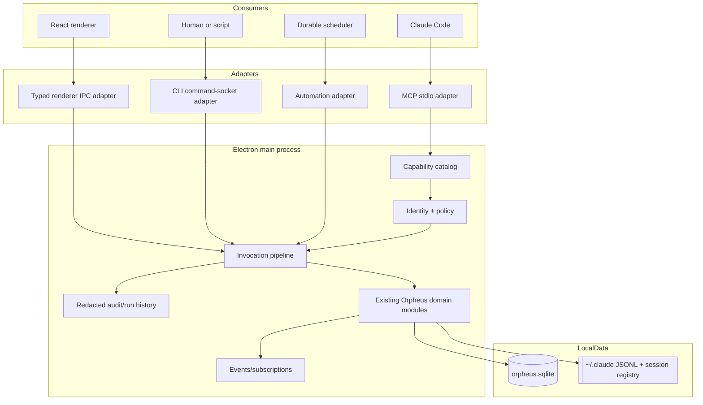

# Agentic Control Plane Architecture

## 1. Boundary and invariants

The control plane is an in-process main-process service. It is not a new source
of domain truth: SQLite, Claude JSONL/session files, and existing Orpheus domain
modules remain authoritative. It centralizes the contract around those modules.

Invariants:

1. Every live mutation crosses one authorization and audit boundary.
2. Capability semantics are independent of MCP, Electron IPC, Unix sockets,
   and schedulers.
3. MCP discovers agent-safe capabilities from the canonical catalog.
4. The renderer, CLI, MCP, and automations do not reimplement domain policy.
5. CLI offline reads remain separate and available with the app stopped.
6. Low-level UI/terminal primitives may remain for compatibility, but are not
   automatically published to agents or automations.
7. Migration is additive; no phase removes or deprecates the CLI or its reads.

## 2. Target topology



The current `cmd.sock` and its one app-global same-user token remain a valid
local transport for the CLI and may carry the first MCP adapter. That token
proves access to the app instance, not caller identity: current workspace
context is caller-supplied ambient context. Phase 2 adds main-issued,
runtime-scoped leases. Transport neutrality means domain handlers never receive
HTTP requests, MCP messages, or Electron events; adapters translate them into a
common invocation.

## 3. Canonical operation and permission contract

An operation descriptor is the only public definition of an invocation. Its
`permission` names the plural capability evaluated by the identity/permissions
model:

```ts
type OperationDescriptor = {
  id: string
  permission:
    | 'identity.read'
    | 'projects.read'
    | 'workspaces.read'
    | 'workspaces.create'
    | 'workspaces.open'
    | 'workspaces.send'
    | 'workspaces.wait'
    | 'reviews.read'
    | 'reviews.resolve'
    | 'ui.workbench.control'
    | 'terminals.control'
    | 'settings.workspace.patch'
  version: 1
  kind: 'query' | 'mutation' | 'subscription'
  description: string
  inputSchema: JsonSchema
  outputSchema: JsonSchema
  surfaces: Array<'mcp' | 'renderer' | 'cli' | 'automation'>
  risk: 'read' | 'local-write' | 'process-control'
  scope: 'self' | 'project' | 'app'
  idempotency: 'none' | 'keyed' | 'natural'
}
```

An invocation contains `{ operationId, params, context }`. Context contains a
principal id/type, consumer, current workspace/project, request id, and optional
automation run id. The result is a stable success/error envelope with a typed
code, message, value, and optional freshness metadata.

Operation descriptors, validation, authorization, and handlers live in one
catalog. Permission names and target rules follow
[identity-and-permissions.md](identity-and-permissions.md).
Adapters may rename commands or render friendlier output, but cannot redefine
accepted inputs or policy.

The current `src/main/actions/registry.ts` and
`src/main/commandServer.ts` dispatch table are migration inputs. During Control
Foundation, existing action ids are bridged into the catalog one at a time.
Compatibility routes may forward to the new invocation pipeline indefinitely.

## 4. Adapter responsibilities

### MCP

Orpheus ships a managed local MCP stdio adapter. The preferred direction is to
attach it to each Orpheus-composed Claude launch with a managed launch-time
`--mcp-config`, without mutating user/global `.mcp.json`. The exact
`composeClaudeLaunch` integration and Claude CLI behavior must be verified
during Phase 2 rather than assumed here. The adapter receives a main-issued
runtime-scoped lease; the existing app-global token and ambient workspace
context are not treated as runtime identity.

MCP is the primary agent discovery contract:

- `tools/list` is generated from catalog descriptors allowed for that context;
- JSON schemas come from the catalog, not hand-written MCP copies;
- read tools arrive before mutation tools;
- self/project restrictions are visible in descriptions and enforced in core;
- internal/renderer-only capabilities are omitted, not merely documented as
  forbidden.

Resources may provide identity, status, and documentation, but state-changing
work remains explicit tools. `orpheus ai skill` and `orpheus ai schema` remain
supported fallbacks and shell-oriented documentation.

### Renderer

Typed IPC maps renderer intent to the same invocation pipeline. Existing
`actions:*` IPC in `src/main/ipc/actions.ts` remains compatible. Renderer-only
presentation state stays in the renderer; semantic workbench commands are
targeted messages such as “open this file in my workspace,” never fabricated
pointer events.

### CLI

The CLI has two deliberate paths:

- **offline queries:** `packages/orpheus-cli/src/reads/` reads SQLite and Claude
  files directly and never auto-launches Orpheus;
- **live operations:** `packages/orpheus-cli/src/socket-client.ts` uses the
  command socket, which adapts requests to the control core.

Existing command names, JSON output, exit-code behavior, auto-launch rules, and
background/focus defaults remain compatibility contracts. MCP does not replace
them.

### Automation

The scheduler invokes the core in-process with an automation principal. It
cannot bypass catalog policy or call renderer clicks/CLI subprocesses. A
persisted automation stores trigger, operation id, validated params, scope,
limits, enabled state, and idempotency policy. Each run stores timestamps,
result, retry decision, and audit correlation id.

## 5. Semantic control

Public operations describe outcomes and name explicit permissions:

- `self.get` → `identity.read`
- project reads → `projects.read`
- workspace list/detail/status/transcript → `workspaces.read`
- workspace creation/fork → `workspaces.create`
- workspace open/mount → `workspaces.open`
- Claude input → `workspaces.send`
- workspace completion subscription → `workspaces.wait`
- review list → `reviews.read`
- review resolution → `reviews.resolve`
- Workbench presentation control → `ui.workbench.control`
- authorized plain-terminal control → `terminals.control`
- workspace settings updates → `settings.workspace.patch`

They do not describe implementation gestures such as “click sidebar item,”
“press Return,” “find a DOM node,” or “type at coordinates.” A semantic handler
may internally reuse existing renderer-open or terminal-injection machinery,
but that mechanism is private and replaceable.

Current low-level actions such as `terminal.sendInput`, `terminal.sendKeys`, and
CLI `ws send` remain supported for explicit steering and compatibility. They are
not automatically MCP- or automation-visible.

Self Workbench/Panes Control is scoped to the caller's workspace. Cross-workspace
UI manipulation is out of scope unless a future capability names and authorizes
that intent explicitly.

## 6. Reads, freshness, and observability

Every observable result identifies its source where ambiguity matters:
`live`, `sqlite`, `claude-jsonl`, or `claude-session-file`, with `observedAt`
and optional `stale`/`unavailable` metadata.

The read hierarchy is:

1. use live main-process state when the app owns authoritative state;
2. use persisted SQLite shadows for app-independent summaries;
3. use Claude JSONL/session files for transcripts and Claude-owned status;
4. return unavailable when no authoritative source exists.

Terminal Observability never uses screenshot OCR or renderer scraping.
Claude-workspace observation starts from `src/main/sessionState.ts`,
`src/main/sessions.ts`, and `src/main/actions/session.ts`. Pane/workbench
terminals expose lifecycle, configured command/cwd, and native surface phase
first. Text tails are added only when a trustworthy stream exists.

Subscriptions use the same event vocabulary as queries. Initial snapshot plus
monotonic events prevents a subscribe race. Events carry entity id, revision or
timestamp, and correlation id; adapters handle their own framing.

## 7. Identity, policy, and safety

The local threat model remains single-user macOS. `cmd.sock` and its token file
retain `0600` permissions. Today the token is app-global for the same-user
socket and requests may carry caller-supplied ambient workspace context; neither
is trusted runtime identity. Phase 2 introduces random runtime-scoped bearer
leases registered and resolved by main, rotating when that runtime restarts.
Transport access is necessary but not sufficient: the invocation pipeline also
applies:

- current-workspace identity and same-project defaults;
- explicit authorization for cross-project access;
- self-close/self-archive protection;
- workspace depth/children limits;
- allowlisted settings/resource writes;
- secret-field denial and recursive redaction;
- risk and surface filtering from descriptors;
- timeout, concurrency, and body/output-size limits.

Caller-supplied workspace ids are treated as claims and resolved against known
state. Automations use persisted principals, not fabricated workspace env.
Mutations record principal, consumer, capability, redacted params, result code,
request/correlation id, and time. Automation run history links to the same audit
entry.

## 8. Additive migration

Migration proceeds vertically:

1. add a descriptor and core handler around an existing domain function;
2. test policy and result behavior in-process;
3. forward the existing renderer or `/cmd` route through it;
4. publish it to MCP only when its schema and policy are agent-safe;
5. optionally make it automation-eligible after idempotency and limits exist.

Direct readers are not forced through the live core. Existing routes may remain
as compatibility adapters. Database changes use the declarative engine in
`src/main/db/`; additive columns/tables and named data steps are preferred.
No migration step requires deleting old command routes.

The eight delivery phases are: Control Foundation; Self Identity + Read-only
MCP; Workspace Orchestration; Self Workbench/Panes Control; Terminal
Observability; Settings/Resources; Durable Automations; Integrated Validation.
There is no Phase F or later deletion/deprecation phase.

## 9. Failure model and validation

Stable error classes include `invalid`, `not_found`, `forbidden`, `conflict`,
`busy`, `unavailable`, `timeout`, and `failed`. Adapter-specific exit codes or
MCP error payloads map from these codes; handlers do not throw transport-shaped
errors.

Integrated validation covers:

- catalog/schema parity across published adapters;
- MCP discovery from a fresh managed workspace;
- CLI offline reads with Orpheus stopped;
- live CLI, renderer, and MCP parity for shared capabilities;
- same-project, self-action, secret, and fan-out denial paths;
- restart/reconnect and subscription initial-snapshot races;
- automation idempotency, retry, timeout, disable, and recovery;
- audit redaction and correlation;
- absence of click/coordinate simulation from the public catalog.

## 10. Decision records

| ID | Decision | Consequence |
| --- | --- | --- |
| ACP-001 | The control core is transport-neutral and in the Electron main process. | Domain policy is shared; adapters stay thin. |
| ACP-002 | MCP is the primary agent discovery surface. | Managed sessions get zero-config, schema-driven tools. |
| ACP-003 | The CLI remains supported, including offline SQLite/JSONL reads. | MCP is additive, not a replacement. |
| ACP-004 | Public control is semantic, not click/key simulation. | UI and terminal implementations can change without breaking tools. |
| ACP-005 | Operation descriptors are the single contract for schema, required permission, and surface eligibility. | No independently maintained MCP/IPC/CLI operation definitions. |
| ACP-006 | Existing `cmd.sock`, Quick Actions, and routes migrate through compatibility adapters. | Delivery is incremental and reversible. |
| ACP-007 | Read results expose source and freshness. | Offline/stale state is honest rather than silently treated as live. |
| ACP-008 | Mutations share identity, policy, redaction, and audit. | Renderer, agents, CLI, and automations have equivalent safety. |
| ACP-009 | Low-level terminal actions remain compatible but are not automatically agent-visible. | Explicit steering survives without becoming the primary API. |
| ACP-010 | Automations persist intent and invoke the core directly. | No shell/CLI or renderer-click automation layer. |
| ACP-011 | Textual terminal observation requires an authoritative stream. | No OCR, screenshot scraping, or invented output. |
| ACP-012 | The plan has no deletion/deprecation phase. | Completion is based on parity and adoption, not removal of working surfaces. |
