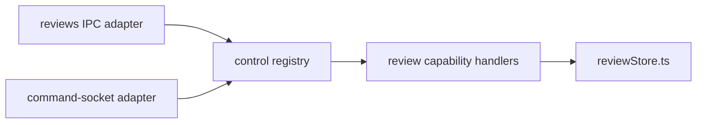

# Phase 1: Control Foundation

**Status:** implemented and statically tested<br>
**Roadmap:** [roadmap.md](roadmap.md)<br>
**Proof slice:** `reviews.list` and `reviews.setResolved`

> **Historical phase record.** This document preserves the Phase 1 delivery
> boundary and its evidence. Later phases now publish both review operations to
> managed MCP, including scoped, audited `reviews.setResolved`. See
> [README.md](README.md#2026-07-28-current-source-delta) for current aggregate
> behavior.

## Outcome

Add a small, transport-neutral control registry and route the two existing
review-comment operations through it. The renderer IPC and CLI command-socket
contracts remain exactly as they are. This phase proves shared semantics before
MCP, broader action discovery, workspace orchestration, or persistence changes.

This is an additive internal foundation:

- no CLI files or behavior change;
- no database schema or data migration;
- no new renderer API;
- no MCP server;
- no automation;
- no `actions:list` exposure;
- no deletion or deprecation.

## Why this proof slice

`reviews.list` and `reviews.setResolved` already span the two live adapter
families the control plane must reconcile:

- renderer IPC: `src/main/ipc/reviews.ts`;
- command socket: the `reviews.list` and `reviews.setResolved` entries in
  `src/main/commandServer.ts`;
- domain implementation: `src/main/reviewStore.ts`;
- CLI consumers: `packages/orpheus-cli/src/commands/reviews.ts`.

One is a query and one is a mutation. They have small inputs, stable outputs,
and no terminal/native lifecycle dependency, so review can focus on the control
contract rather than unrelated behavior.

## Required architecture

Add a main-process control-plane module with no Electron, HTTP, MCP, renderer,
or CLI types in its public contract. A suitable additive shape is:

```text
src/main/controlPlane/
  types.ts                 # descriptor, context, invocation, result/error
  registry.ts              # register, describe, invoke
  reviewCapabilities.ts    # proof-slice descriptors and handlers
  index.ts                 # boot/export surface
```

Exact internal file splitting may change during implementation, but the
dependency direction may not:



The registry is the only owner of proof-slice descriptor ids, validation, and
handler selection. Adapters remain responsible for translating their existing
request and response envelopes.

## Minimal contract

### Descriptor

Each registered operation declares:

- stable id;
- required permission capability (`reviews.read` or `reviews.resolve` for this
  proof slice);
- version (`1`);
- kind (`query` or `mutation`);
- description;
- runtime input validator;
- input/output schema or schema-ready metadata;
- allowed surfaces;
- scope/risk metadata;
- handler.

Phase 1 needs enough schema metadata to prove a self-describing registry, but it
does not publish that metadata to `actions:list`, MCP, or the CLI.

### Invocation context

Use one internal context shape:

```ts
type ControlContext = {
  principal: {
    type: 'renderer-user' | 'workspace-agent' | 'cli' | 'automation'
    id: string
  }
  consumer: 'renderer-ipc' | 'command-socket' | 'mcp' | 'automation'
  workspaceId: string | null
  projectId: string | null
  requestId: string
}
```

Phase 1 adapters populate only fields they can establish honestly. Current
command-socket access uses one app-global same-user token and caller-supplied
ambient context; it is not runtime authentication. Missing project context
remains `null`; do not fabricate it. Phase 2 adds main-issued runtime bindings
and per-runtime bearer leases without changing the invocation shape.

### Result

The registry returns a transport-neutral result:

```ts
type ControlResult<T> =
  | { ok: true; value: T }
  | {
      ok: false
      code:
        | 'invalid'
        | 'not_found'
        | 'forbidden'
        | 'conflict'
        | 'busy'
        | 'unavailable'
        | 'timeout'
        | 'failed'
      error: string
    }
```

Adapters map this result back to their pre-existing envelope. Phase 1 must not
change public error strings or success payload shapes for the proof operations.

## Proof capability definitions

### `reviews.list`

- Kind: query.
- Required permission metadata: `reviews.read`.
- Input: `{ workspaceId: string }`.
- Validation: non-empty workspace id.
- Handler: call `listByWorkspace` from `src/main/reviewStore.ts`.
- Output: the existing ordered `LocalReviewComment[]`.
- Audit: none in Phase 1; queries are not mutation-audited.
- Surface eligibility in the descriptor: renderer and command socket only.

The command-socket adapter preserves its current context fallback: use
`context.workspaceId` first, then `args.workspaceId`, otherwise return the same
required-workspace error. The adapter passes the resolved id to the registry;
the registry does not understand socket fallback rules.

The renderer IPC adapter continues accepting its current typed payload and
returning the current array directly.

### `reviews.setResolved`

- Kind: mutation.
- Required permission metadata: `reviews.resolve`.
- Input: `{ id: string, resolved: boolean }`.
- Validation: non-empty id and actual boolean.
- Handler: call `setResolved` from `src/main/reviewStore.ts`.
- Output: the existing updated `LocalReviewComment`.
- Surface eligibility in the descriptor: renderer and command socket only.

Phase 1 does not add a second audit record if the existing path already audits
the operation. If this operation is not currently audited, audit integration is
documented for the wider foundation follow-up rather than silently changing
observable persistence in this proof slice.

## Adapter preservation

### Renderer IPC

Keep the existing channel names, request types, and direct return values in
`src/main/ipc/reviews.ts`:

- `reviews:list`;
- `reviews:setResolved`.

Only the internal call changes: translate the IPC payload to a control
invocation and unwrap/map the control result. Do not change
`src/shared/ipc.ts`, `src/preload/index.ts`, or renderer callers unless required
solely for type preservation.

### Command socket

Keep all current behavior in `src/main/commandServer.ts`:

- `POST /cmd`;
- `x-orpheus-token` app-instance socket access (not runtime authentication);
- request body `{ action, args, context }`;
- action strings `reviews.list` and `reviews.setResolved`;
- success envelope `{ ok: true, data }`;
- domain-error envelope `{ ok: false, error }` with HTTP 200;
- malformed/unknown-action HTTP behavior;
- request-size and timeout behavior.

The two dispatch entries become thin translations to the control registry. The
registry must not import HTTP request/response types.

### CLI

Do not edit `packages/orpheus-cli/`, `resources/bin/orpheus`, packaging, PATH
injection, JSON rendering, exit-code mapping, or offline readers. Existing CLI
review commands continue reaching the same command-socket action strings and
receive the same envelopes.

### Quick Actions discovery

Do not register the proof capabilities in the existing Quick Actions registry
and do not alter `actions:list`. Phase 1 must not make `reviews.list` or
`reviews.setResolved` appear in footer/action discovery. Catalog publication is
a separate product decision in later phases.

## Implementation sequence

1. Add pure control types and registry with duplicate-id rejection.
2. Add `describe(id)`/internal listing for tests, without adapter publication.
3. Add invocation validation and stable not-found/invalid/failed results.
4. Register the two review capabilities with injected or directly imported
   `reviewStore` handlers while preserving dependency direction.
5. Adapt `src/main/ipc/reviews.ts` to invoke and unwrap the registry.
6. Adapt only the two review entries in `src/main/commandServer.ts`.
7. Add deterministic registry/proof-slice tests or a repository-style
   verification harness.
8. Run the static verification listed below.

Boot must register capabilities before either adapter can receive requests.
Repeated boot in a test must be deterministic; duplicate registration should
fail clearly rather than silently overwrite a descriptor.

## Tests

The Phase 1 harness must cover:

- registration and `describe` return the declared id, required plural
  permission, kind, version, surface, and schema metadata;
- duplicate registration is rejected;
- unknown capability returns `not_found`;
- invalid `reviews.list` and `reviews.setResolved` params return `invalid`
  without calling a handler;
- handler success preserves the existing list and updated-comment shapes;
- handler throw becomes `failed` without leaking a transport exception;
- context and request id reach the handler unchanged;
- the renderer adapter returns the same raw values as before;
- the command adapter preserves `{ ok: true, data }` and
  `{ ok: false, error }`;
- command-socket workspace-id fallback behavior is unchanged;
- `actions:list` output is unchanged and excludes both proof capabilities;
- no module under the control registry imports Electron, preload, renderer, CLI,
  HTTP, or MCP modules.

Prefer dependency injection or in-memory fake handlers for registry tests.
Database integration is not required to prove the transport-neutral contract;
existing `reviewStore.ts` remains the tested/known domain implementation.

## Acceptance criteria

- There is one handler registration for each proof capability.
- Both existing adapters invoke those registrations.
- Public IPC and socket action/envelope contracts are unchanged.
- The CLI tree has no diff.
- `actions:list` has no new entries.
- No DB schema/data change exists.
- Invalid inputs are rejected before domain handler execution.
- Stable control errors are mapped at the adapter boundary.
- Static dependency checks show the core is transport-neutral.
- All added tests/harness assertions pass.

## Verification scope

Phase 1 is verified statically only. Do not launch `Orpheus Dev.app`, mount a
terminal, operate the renderer, or claim live CLI/socket QA as part of this
phase.

Required implementation verification:

```bash
bun run typecheck
bun run lint
bun run check:dup
bun run check:arch
bunx prettier --check <phase-1-owned-files>
```

Also run the new deterministic control-plane harness/test command. Report:

- static commands that passed;
- any command that could not run;
- live IPC/socket/CLI behavior as explicitly untested.

`bun run check` may replace its component commands when it covers the same
files, but the handoff must still name the actual checks run.

## Risks and mitigations

| Risk | Mitigation |
| --- | --- |
| A third registry increases drift | Limit Phase 1 to two capabilities and make the new catalog canonical for them; do not copy their validation into adapters |
| Adapter envelopes accidentally change | Add adapter mapping assertions and avoid shared transport-shaped result types |
| Quick Actions discovery changes unexpectedly | Do not register with `src/main/actions/registry.ts`; assert `actions:list` is unchanged |
| Error messages or CLI exit behavior drift | Preserve socket error text/envelopes and leave CLI code untouched |
| Context is treated as authenticated identity | Model it as an explicit claim in Phase 1; authorization hardening arrives with Self Identity |
| Audit duplicates mutation records | Do not add new persistence/audit behavior in the proof slice |
| New imports create a main-process cycle | Keep the registry leaf-like and enforce with `check:arch` plus an import-boundary test |
| Over-general design delays proof | Implement only fields required by the proof and the already-decided future adapters |

## Rollback

Rollback is code-only:

1. restore the two IPC handlers to direct `reviewStore` calls;
2. restore the two command-server dispatch entries to their current direct
   calls;
3. remove the new control-plane modules and harness.

No user data, SQLite schema, CLI bundle, MCP configuration, or persisted setting
is changed, so rollback requires no migration or cleanup. The pre-Phase-1
renderer and CLI behavior is immediately restored.

## Explicitly deferred

- MCP adapter and tool publication;
- identity authentication/authorization beyond current adapter context;
- workspace orchestration;
- workbench/panes control;
- terminal observability;
- settings/resources;
- durable automations;
- general Quick Actions/catalog unification;
- removal or deprecation of any existing surface.
