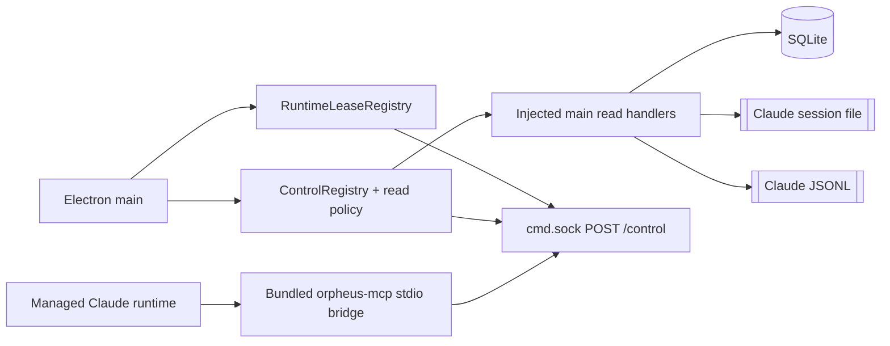

# Phase 2: Self Identity + Read-only MCP

**Status:** implemented, deterministically tested, and live-validated<br>
**Roadmap:** [roadmap.md](roadmap.md)<br>
**Depends on:** [Phase 1: Control Foundation](phase-01-control-foundation.md)

## Outcome

Phase 2 adds a bundled Orpheus MCP stdio bridge to Orpheus-managed Claude
launches. A managed Claude runtime can discover a context-filtered read catalog,
identify itself, and read its authorized project, workspaces, Claude status,
transcript, last turn, and local review comments.

The implementation is additive:

- the existing renderer IPC, `/cmd`, CLI, Quick Actions, and offline reads remain;
- no SQLite schema or data migration is added;
- no user or project `.mcp.json` is written;
- no account-wide dashboard or provider source is published;
- no mutation is published through MCP;
- no network request is needed for a Phase 2 read.

The implementation and deterministic harnesses are complete. Live validation
in `Orpheus Dev.app` confirmed managed Claude MCP discovery, trusted self
identity, non-enumerating cross-project denial, and retained-surface identity.
The roadmap's Phase 2 exit criterion is complete.

## Delivered architecture



The dependency boundaries are:

- `src/main/controlPlane/registry.ts` owns registration, contextual discovery,
  validation, authorization, invocation, and stable control results;
- `readCapabilities.ts` owns MCP-visible operation ids and JSON Schemas;
- `readPolicy.ts` owns trusted-runtime permission and same-project filtering;
- `runtimeLeases.ts` owns process-local runtime attribution and bearer leases;
- `mainReadHandlers.ts` adapts existing SQLite/session/JSONL domain reads;
- `transcriptObservation.ts` performs the bounded JSONL scan;
- `src/main/commandServer.ts` owns the `/control` transport;
- `packages/orpheus-mcp/` translates the catalog to MCP `tools/list` and tool
  calls to control invocations;
- `managedMcpLaunch.ts` and `orpheusSurfaceAdapter.ts` attach the bundled bridge
  and server-owned runtime environment to managed Claude launches.

The control core contains no MCP SDK, HTTP, Electron renderer, or CLI command
types. The MCP bridge contains no SQLite or Orpheus domain implementation.

## Published operation catalog

Every Phase 2 MCP descriptor is version `1`, kind `query`, risk tier `0`, and
has a strict object input schema with `additionalProperties: false`.

| Operation                  | Permission        | Input and default                                                                                   | Output                                                               |
| -------------------------- | ----------------- | --------------------------------------------------------------------------------------------------- | -------------------------------------------------------------------- |
| `self.get`                 | `identity.read`   | `{}`                                                                                                | Live identity observation                                            |
| `projects.list`            | `projects.read`   | `{}`; bound project only                                                                            | SQLite observation of project summaries                              |
| `projects.get`             | `projects.read`   | Optional non-empty `projectId`; defaults to bound project                                           | SQLite project observation                                           |
| `workspaces.list`          | `workspaces.read` | Optional non-empty `projectId`; optional `scope` (`active`, `archived`, or `all`), default `active` | SQLite observation of workspace summaries                            |
| `workspaces.get`           | `workspaces.read` | Optional non-empty `workspaceId`; defaults to bound workspace                                       | SQLite workspace observation                                         |
| `workspaces.getStatus`     | `workspaces.read` | Optional non-empty `workspaceId`; defaults to bound workspace                                       | Claude-session-file observation containing persisted and live status |
| `workspaces.getTranscript` | `workspaces.read` | Optional workspace, `limit` 1–100, `role`, non-negative `since`, and `includeToolActivity`          | Bounded Claude-JSONL observation                                     |
| `workspaces.getLastTurn`   | `workspaces.read` | Optional non-empty `workspaceId`; defaults to bound workspace                                       | Claude-JSONL last-turn observation                                   |
| `reviews.list`             | `reviews.read`    | Required non-empty `workspaceId`                                                                    | Existing ordered `LocalReviewComment[]`                              |

`reviews.setResolved` remains registered for the existing renderer and command
socket, but it is not MCP-eligible and is omitted from contextual discovery.

Catalog publication exposes only:

- operation id and version;
- kind and description;
- self-contained input and output JSON Schemas.

Permission, scope, surface, and risk metadata remain server-side policy inputs.
The MCP bridge does not maintain a second tool list or hand-written schema copy.

## Identity and lease lifecycle

### Issuance

Before a new Claude surface is launched, main creates an immutable pending
binding:

```ts
type ClaudeRuntimeBinding = {
  runtimeId: string
  runtimeKind: 'claude'
  surfaceId: string
  workspaceId: string
  projectId: string
  claudeConversationId: string | null
  parentWorkspaceId: string | null
  forkedFromConversationId: string | null
  issuedAt: number
  state: 'pending' | 'live'
  pid: number | null
}
```

The registry generates a random runtime id and a 32-byte base64url bearer
token. It returns the raw token only on first issuance and stores only its
SHA-256 digest. Bindings and issue results are frozen.

A repeated mount for the same retained surface and identical identity reuses
the binding without re-exposing the token. A newly created native surface must
receive a newly created lease; mismatched create/reuse outcomes fail closed and
tear down or revoke the surface binding.

### Launch attribution

Main appends server-owned runtime values after user settings, auth, custom
environment, and routing overlays so those layers cannot override them:

- `ORPHEUS_RUNTIME_CONTEXT_VERSION=1`;
- `ORPHEUS_RUNTIME_ID`;
- `ORPHEUS_RUNTIME_KIND=claude`;
- `ORPHEUS_SURFACE_ID`;
- `ORPHEUS_PROJECT_ID`;
- `ORPHEUS_WORKSPACE_ID`;
- optional `ORPHEUS_CLAUDE_CONVERSATION_ID`;
- `ORPHEUS_RUNTIME_LEASE_TOKEN`.

These environment values carry the bridge credential and diagnostic context,
but they do not create server identity. `/control` resolves the bearer token
against main's process-local lease registry and reconstructs the trusted
context from that binding.

### Pending, live, and revocation

- Pending leases expire after 60 seconds by default.
- Claude session-file observation marks the matching runtime live and records
  its PID.
- A pending workspace without a preassigned conversation may adopt the first
  observed conversation for that workspace.
- A mismatched conversation revokes the surface binding.
- A live Claude process disappearing revokes the lease; falling through to the
  wrapper's interactive shell does not retain Claude-agent authority.
- Hiding and reattaching a retained native surface preserves its lease.
- surface destruction, workspace teardown, mount/launch failure, runtime
  replacement, and app quit revoke the applicable lease.
- restart creates a new runtime id and token; revoked tokens do not resolve.

PID, cwd, ambient ids, and the app-global command token are observations or
compatibility inputs, not runtime authentication.

## `/control` protocol

The bridge uses HTTP over the existing local Unix socket, but `/control` has a
credential and protocol separate from `/cmd`.

### Authentication

```http
POST /control
Content-Type: application/json
X-Orpheus-Runtime-Lease: <runtime bearer token>
```

A missing, invalid, expired, or revoked lease returns HTTP `401`:

```json
{
  "ok": false,
  "error": {
    "code": "unauthorized",
    "message": "A valid runtime lease is required."
  }
}
```

There is no fallback to `x-orpheus-token`, `ORPHEUS_CMD_TOKEN`, ambient
workspace context, cwd matching, or request-supplied identity.

### Catalog

Request:

```json
{ "protocolVersion": 1, "op": "catalog" }
```

Success:

```json
{
  "ok": true,
  "data": {
    "protocolVersion": 1,
    "capabilities": [
      {
        "id": "self.get",
        "version": 1,
        "kind": "query",
        "description": "...",
        "inputSchema": {
          "type": "object",
          "additionalProperties": false,
          "properties": {}
        },
        "outputSchema": {
          "type": "object"
        }
      }
    ]
  }
}
```

The schemas in this envelope example are abbreviated; the real catalog returns
the complete self-contained schemas registered for each operation.

The server generates this list through `listControl(context)`. Surface
eligibility, effective read grants, risk, and bound defaults filter the catalog
before it reaches the bridge.

### Invocation

Request:

```json
{
  "protocolVersion": 1,
  "op": "invoke",
  "id": "workspaces.get",
  "input": {}
}
```

Success:

```json
{ "ok": true, "data": {} }
```

A validated control failure remains HTTP `200` and uses:

```json
{
  "ok": false,
  "error": {
    "code": "not_found",
    "message": "Requested resource was not found."
  }
}
```

Malformed JSON or a request with unknown/extra protocol fields returns HTTP
`400`. The shared command-server request limit is 10 MiB. The MCP bridge applies
a separate 2 MiB response limit and a 35-second request timeout. An unexpected
server failure returns a redacted HTTP `500` error without exposing internal
exceptions.

## Managed `--mcp-config`

For a runtime with a lease, launch composition appends one flag pair:

```text
--mcp-config
{"mcpServers":{"orpheus-control":{"type":"stdio","command":"<absolute Resources>/bin/orpheus-mcp","args":[]}}}
```

The inline config:

- names one managed server, `orpheus-control`;
- uses the app bundle's absolute `Contents/Resources/bin/orpheus-mcp` path;
- contains no bearer token, runtime id, environment block, or other secret;
- does not use `--strict-mcp-config`;
- does not create or modify user, project, or global `.mcp.json`.

The bearer token and command-socket path arrive through the already composed
runtime environment. The bridge reads `ORPHEUS_CMD_SOCK` and
`ORPHEUS_RUNTIME_LEASE_TOKEN`, posts to `/control`, and reserves stdout for MCP
JSON-RPC frames.

`resources/bin/orpheus-mcp` sets `ELECTRON_RUN_AS_NODE=1` and executes the
matching app binary with `Contents/Resources/mcp/mcp.cjs`. The shim recognizes
`Orpheus WT`, `Orpheus Dev`, and `Orpheus` bundles.

## Read sources and freshness

New read operations use:

```ts
type ControlReadObservation<T> = {
  value: T | null
  source: 'live' | 'sqlite' | 'claude-jsonl' | 'claude-session-file'
  observedAt: number
  sourceUpdatedAt: number | null
  availability: 'available' | 'unavailable' | 'unsupported'
  stale: boolean | null
  reason?: string
}
```

| Read                        | Source and freshness behavior                                                                                                                                                                                                                       |
| --------------------------- | --------------------------------------------------------------------------------------------------------------------------------------------------------------------------------------------------------------------------------------------------- |
| `self.get`                  | `live`; `observedAt` is handler time, `sourceUpdatedAt` is null. SQLite lookups enrich the trusted binding but cannot replace it.                                                                                                                   |
| Project and workspace reads | `sqlite`; `observedAt` is query time. `sourceUpdatedAt` is the greatest relevant persisted record timestamp, or null when none exists.                                                                                                              |
| `workspaces.getStatus`      | `claude-session-file`; combines the persisted SQLite status with the raw live status and optional `waitingFor`. `sourceUpdatedAt` is Claude's `statusUpdatedAt`. Missing workspace/session data is explicit unavailable state, not fabricated idle. |
| Transcript and last turn    | `claude-jsonl`; `observedAt` is scan time and `sourceUpdatedAt` is file mtime. Missing conversation, missing/non-file path, and I/O failure are explicit unavailable observations.                                                                  |
| `reviews.list`              | Direct SQLite read preserving the existing `LocalReviewComment[]` compatibility shape. It is the Phase 2 legacy-shape exception and carries no observation timestamp in its payload.                                                                |

Transcript reads inspect at most the final 4 MiB, retain at most 100 turns
(default 20), cap each turn's text at 64 KiB, and report `truncated` plus
`bytesRead`. A scan that starts within a large file skips the first partial
line. Malformed lines and text truncation set `truncated`; role and timestamp
filters are applied after parsing. Tool activity is included only when
requested.

Last-turn reads use the same bounded scan and return the last observed user and
assistant text/timestamps. They do not claim full-history coverage when the
JSONL exceeds the scan bound.

## Authorization and security boundaries

Phase 2 runtime grants are fixed to:

- `identity.read`;
- `projects.read`;
- `workspaces.read`;
- `reviews.read`.

The registry checks surface eligibility and runtime validation before the
policy, then authorizes before invoking a handler. MCP policy requires a trusted
binding, a granted permission, query kind, and risk tier `0`.

Target rules are:

1. An omitted project/workspace target defaults only from the trusted binding.
2. Ambient `ControlContext.workspaceId` and `projectId` do not supply MCP
   defaults or authority.
3. An explicit project must equal the bound project.
4. An explicit workspace is resolved server-side and must belong to the bound
   project.
5. Unknown and cross-project targets return the same non-enumerating
   `not_found` result.
6. Context-filtered discovery omits forbidden tools rather than publishing
   unusable mutation or cross-scope descriptors.

Additional boundaries:

- `/control` never accepts caller-supplied principal, runtime, permission, or
  trusted target fields.
- The raw lease token is not stored in the registry, catalog, managed MCP
  config, results, or diagnostics.
- The bridge uses only the local Unix socket and makes no network request.
- Account-wide GitHub, provider usage, all-history activity, credentials,
  settings, terminal input, and UI control are not published.
- Local filesystem paths in authorized project/workspace results are visible
  to the runtime already bound to that project.

The lease is a scoped local bearer credential, not a sandbox against every
same-user process on the machine. Its security value is immutable server-side
attribution, narrow grants, lifecycle revocation, and the absence of ambient
fallback.

## Compatibility

- `/cmd`, `x-orpheus-token`, response envelopes, and action strings are
  unchanged.
- Existing `reviews:list` and `reviews:setResolved` renderer IPC remain.
- MCP enforces non-empty, no-extra-field `reviews.list` input while legacy
  renderer/socket validation preserves its previous compatibility behavior.
- `reviews.setResolved` remains available only to renderer and command socket.
- `actions:list` and Quick Actions discovery are unchanged.
- `packages/orpheus-cli` offline SQLite/JSONL reads remain independent and work
  without the app.
- Existing CLI environment and `ORPHEUS_WORKSPACE_ID` target inference remain,
  but do not authenticate `/control`.
- Existing user/project MCP configuration management remains separate; managed
  launch configuration is ephemeral.
- There is no persistence migration and rollback requires no data cleanup.

## Packaging variants

All three builder manifests package the same two artifacts:

```text
Contents/Resources/bin/orpheus-mcp
Contents/Resources/mcp/mcp.cjs
```

`build:agents` builds both the existing CLI and MCP bundles. It is part of:

- `build:dev` → `Orpheus Dev.app`, development data;
- `build:wt` → `Orpheus WT.app`, worktree data;
- `build:mac` → `Orpheus.app`, production data.

`ORPHEUS_DATA_VARIANT` remains `dev`, `wt`, or `prod` respectively, so the MCP
bridge uses the command socket inherited from the matching app runtime. The
production build remains CI/release-owned; this phase does not authorize a
local production install.

## Deterministic verification

The implementation has deterministic coverage for:

```bash
bun run scripts/verify-control-plane.ts
bun run scripts/verify-control-plane-phase2.ts
bun run scripts/verify-runtime-leases.ts
bun run scripts/verify-runtime-main-integration.ts
bun run test:mcp
bun run typecheck
bun run typecheck:mcp
bun run lint
bun run check:dup
bun run check:arch
```

The harnesses cover:

- Phase 1 renderer/socket compatibility;
- strict, self-contained schemas with no placeholder references;
- catalog filtering, permission denial, trusted defaults, and same-project
  target checks;
- lease issuance/reuse, digest-only storage, pending expiry, live adoption,
  restart rotation, revocation, and token redaction;
- bounded MCP response handling and timeout behavior;
- real MCP SDK initialize/list/call behavior against a fake Unix control server;
- managed flag shape, absence of config secrets, executable shim, bundle
  presence, and all three builder manifests;
- main-process startup ordering, environment precedence, `/control`
  authentication separation, and teardown guardrails.

These static/offline checks establish the full deterministic contract. The live
acceptance pass below separately proves that a real managed Claude runtime can
start the packaged bridge, discover the catalog, and invoke Orpheus reads.

## Live validation

The Phase 2 live acceptance pass completed in `Orpheus Dev.app`:

- [x] The canonical `bun run build:unpack` flow installed `Orpheus Dev.app`.
- [x] The packaged CLI and MCP artifacts were present and executable, and their
      code signatures verified.
- [x] A fresh managed workspace required no `.mcp.json` edit. Its `/mcp` view
      eventually reported `orpheus-control` connected with exactly nine tools.
- [x] A real `self.get` call authenticated through `runtime_lease` and returned
      the exact bound workspace, project, and Claude conversation.
- [x] An explicit `workspaces.get` call using another project's real workspace
      id returned the non-enumerating `not_found` result.
- [x] Hiding the native surface by navigating to Home, then reattaching it,
      preserved the working `self.get` call and the same workspace identity.

Claude 2.1.220 starts MCP servers asynchronously. During this pass, the first
`/mcp` status snapshot could omit `orpheus-control` while startup was still
pending; a later snapshot showed it connected. Phase 2 therefore guarantees
eventual managed discovery after bridge startup, not presence in the first
status snapshot. The observed behavior does not warrant an Orpheus code change.

Two lifecycle cases were not manually exercised in this pass:

- [ ] restarting the Claude runtime rotates the lease and rejects the prior
      token;
- [ ] quitting the app revokes its runtime leases.

The deterministic runtime-lease and main-integration harnesses cover both
cases. They remain harness-verified, not manually live-verified.

## Rollback

Rollback is code-only:

1. stop injecting the managed `--mcp-config` and runtime lease environment;
2. remove `/control`, the MCP bundle/shim, and Phase 2 read descriptors;
3. retain the Phase 1 registry and existing renderer/socket adapters.

There is no database or user MCP configuration to migrate backward.

## Explicitly deferred

- MCP mutations and approval flows;
- workspace create/start/wait/send/lifecycle orchestration;
- workbench, panes, and terminal control;
- terminal output-tail observation;
- settings and resources;
- account-wide dashboard/provider publication and active refresh;
- durable automations;
- replacement or removal of the existing CLI, `/cmd`, Quick Actions, or
  renderer IPC.
