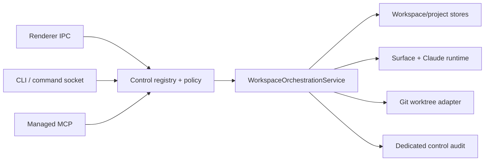

# Phase 3: Workspace Orchestration

**Status:** contract frozen; implementation in progress; not yet implemented<br>
**Roadmap:** [roadmap.md](roadmap.md)<br>
**Interfaces:** [phase-03-interfaces.md](phase-03-interfaces.md)<br>
**Depends on:** [Phase 2: Self Identity + Read-only MCP](phase-02-self-identity-readonly-mcp.md)

## Outcome

Phase 3 adds one main-process `WorkspaceOrchestrationService` for semantic
workspace creation, task start, presentation, steering, waiting, lifecycle,
lineage, and archival. The renderer, command socket, CLI, and MCP adapters
translate their own protocol shapes into this service; none owns workspace
policy or reimplements its effects.

This document freezes the Phase 3 contract before implementation. It does not
claim that the operations below are currently registered, published through
MCP, or live-validated.

The frozen operation set is:

- `workspaces.create`;
- `workspaces.startTask`;
- `workspaces.open`;
- `workspaces.send`;
- `workspaces.wait`;
- `workspaces.close`;
- `workspaces.reopen`;
- `workspaces.rename`;
- `workspaces.archive`;
- `workspaces.getLineage`.

No other workspace mutation is part of Phase 3.

## Architectural boundary



The service owns:

1. server-side target and lineage resolution;
2. strict same-project and runtime-identity checks;
3. depth, child-count, self-action, dirty-worktree, and archival guardrails;
4. server-derived cwd and worktree paths;
5. readiness, send, wait, lifecycle, and presentation sequencing;
6. declared-effect accounting and typed receipts;
7. dedicated, recursively redacted control audit records.

The service may delegate storage, native-surface, process, Git, and transcript
work to existing domain modules. Those modules remain authoritative for their
data, but callers do not compose them directly into a workspace mutation.

Adapters may preserve legacy names, envelopes, output, and exit codes. They
must not weaken service validation, identity, authorization, preflight, or
audit rules.

## Identity and target resolution

MCP mutations require the Phase 2 runtime-scoped lease. Main resolves the
principal, bound runtime, project, workspace, and surface from that lease.
`ORPHEUS_WORKSPACE_ID`, cwd matching, request parameters, PID, and the
app-global command token do not authenticate an MCP caller.

The following rules apply to every Phase 3 operation:

1. An omitted workspace target defaults only to the trusted bound workspace.
2. An omitted project target defaults only to the trusted bound project.
3. Explicit workspace, parent, and lineage targets are resolved server-side.
4. Every resolved workspace must belong to the bound project.
5. Unknown and cross-project targets both return non-enumerating `not_found`.
6. Authorization is rechecked against the resolved target immediately before
   effects begin.
7. A caller may never close or archive its own bound workspace.
8. A runtime lease that is revoked while a bounded wait is active terminates
   the wait without granting authority from ambient context.

Unbound local CLI requests retain their existing target-resolution behavior and
policy class. That compatibility path does not become MCP identity.

## Permission, tier, and effect contract

Phase 3 adds explicit lifecycle permissions rather than treating all workspace
mutation as creation or presentation.

| Operation | Permission | Tier | Maximum declared effects |
| --- | --- | ---: | --- |
| `workspaces.getLineage` | `workspaces.read` | 0 | none |
| `workspaces.create` | `workspaces.create` | 2 | `db.write`, optional `git.worktree.create`, `filesystem.write`, `surface.mount`, `process.spawn`, optional `ui.focus` |
| `workspaces.startTask` | `workspaces.send` | 2 | optional `surface.mount`, optional `process.spawn`, `terminal.input`, optional `ui.focus` |
| `workspaces.open` | `workspaces.open` | 1 | `surface.mount`, optional `process.spawn`, `db.write`, optional `ui.focus` |
| `workspaces.send` | `workspaces.send` | 2 | optional `surface.mount`, optional `process.spawn`, `terminal.input`, optional `ui.focus` |
| `workspaces.wait` | `workspaces.wait` | 0 | none |
| `workspaces.close` | `workspaces.close` | 2 | `surface.destroy`, optional `process.terminate`, `db.write` |
| `workspaces.reopen` | `workspaces.open` | 1 | `db.write` |
| `workspaces.rename` | `workspaces.rename` | 2 | `db.write` |
| `workspaces.archive` | `workspaces.archive` | 3 | optional `surface.destroy`, optional `process.terminate`, optional `git.worktree.remove`, optional `filesystem.delete`, `workspace.delete`, `db.write` |

The operation descriptor declares the maximum effects possible for its validated
input. The response records only effects actually applied, skipped, or failed.
Conditional effects remain authorization inputs when they can occur.

The permission vocabulary therefore includes:

```ts
type Phase3WorkspacePermission =
  | 'workspaces.read'
  | 'workspaces.create'
  | 'workspaces.open'
  | 'workspaces.send'
  | 'workspaces.wait'
  | 'workspaces.close'
  | 'workspaces.rename'
  | 'workspaces.archive'
```

`workspaces.reopen` deliberately reuses `workspaces.open`: it restores a
reversible lifecycle/presentation state. Archive has its own Tier 3 permission
and never inherits from close.

## Creation and lineage

`workspaces.create` supports `local` and `worktree` modes.

- Main derives the workspace cwd. Callers cannot provide a path.
- A local workspace uses the registered project root.
- A worktree workspace receives a server-derived path beneath Orpheus's managed
  worktree root. The caller may provide a validated branch intent, not a path
  or shell command.
- An optional parent establishes lineage. For an MCP caller, the parent must be
  the bound workspace or another authorized workspace in the same project.
- `fork: true` copies the eligible Claude conversation lineage from the resolved
  parent. A fork without an initial task is valid.
- Creation does not accept an initial task. A caller composes
  `workspaces.create` and `workspaces.startTask`, preserving a typed receipt for
  each operation.
- The default presentation is `background`. Focusing is explicit.

Creation-time MCP settings overlays are excluded. The public schema has no
model, permission mode, effort, environment, shell initialization, provider,
or arbitrary settings fields. Existing CLI-only settings flags may remain as a
validated compatibility extension outside the MCP descriptor, but they cannot
weaken service guardrails or expand the public Phase 3 schema. Phase 6 owns the
semantic settings contract.

`workspaces.getLineage` returns the resolved workspace, its ancestor chain, and
its direct children from persisted Orpheus lineage. It is a read, performs no
mount or source refresh, and cannot enumerate another project.

## Start, open, and send

`workspaces.startTask` is the explicit first-task intent. It mounts or starts the
workspace Claude surface when needed, waits for bounded readiness, sends the
task text, and submits it. It does not create the workspace and does not mutate
settings.

`workspaces.open` presents an existing, non-closed workspace. It mounts or
reattaches the surface and starts Claude when necessary. Background is the
default; focus is opt-in. A closed workspace returns `conflict` and must be
restored with `workspaces.reopen` first. A compatibility adapter may compose
reopen and open for an existing legacy command while preserving that command's
output.

`workspaces.send` is ordinary Claude steering after creation. It accepts text
and an explicit submit decision. Arbitrary key names, key codes, escape
sequences, and raw terminal bytes are not part of the MCP contract. Existing
low-level CLI/Quick Action routes may remain compatible, but they are not
published as Phase 3 MCP fields.

Start and send share one internal readiness and input engine. Mount, process
start, readiness, and terminal input are recorded as separate effect receipts.
If readiness is not reached within the adapter's bound, no input effect is
claimed.

## Bounded wait

`workspaces.wait` is a one-shot observation over one or more authorized
same-project workspaces. It returns when each target reaches the requested
terminal condition or the adapter-specific deadline expires.

For MCP:

- `timeoutMs` is an integer from `1` through `25_000`;
- the default is `25_000`;
- one tool invocation never holds the transport longer than 25 seconds;
- timeout is a typed, ordinary wait outcome, not a transport failure;
- callers may invoke again to continue waiting.

The shared wait engine is not limited to 25 seconds. The CLI adapter retains its
existing duration syntax and maximum duration, including its current long waits.
Adapters translate deadlines but share target checks, state vocabulary, and
result semantics.

Wait outcomes are per workspace so a multi-target call can report completion,
blocked input, process death, timeout, or a target that disappeared after
authorization without discarding the other results.

## Close, reopen, and rename

Close is a reversible lifecycle operation. It tears down the live surface and
runtime when present and marks the workspace closed. It has no `force` field.
A caller cannot close itself.

Reopen only clears the closed lifecycle state. It does not implicitly focus,
mount, or start a process; compose it with open when presentation is wanted.

Rename validates a non-empty, normalized display name and updates only workspace
metadata. It does not rename directories, branches, projects, or Claude
conversations.

## Archive safety and partial results

Archive is Tier 3. MCP never exposes a force option.

For `recursive: false`, archive rejects a workspace with direct or transitive
children using `conflict`. It does not orphan or reparent descendants.

For `recursive: true`, the service first resolves the complete subtree and
preflights every node before applying any effect. Preflight verifies:

- every workspace remains in the caller's authorized project;
- the subtree does not contain the caller's bound workspace;
- all child relationships still match the resolved snapshot;
- no managed worktree is dirty or otherwise unsafe to remove;
- each surface/runtime can be safely terminated;
- the caller is authorized for the full subtree and maximum effect set.

Any preflight failure produces no archive effects. A branch is never deleted.

After a successful preflight, deletion proceeds children-first. The response
contains a receipt per workspace and effect. An unexpected failure after effects
begin returns `status: "partial"` with the completed, skipped, and failed
receipts; it never reports total success and never hides which persisted
workspace records remain. Retrying is safe only after the caller reads the
partial result and current lineage.

The implementation should minimize partial states, but the contract represents
them because native process, filesystem, Git, and database effects cannot be
truthfully collapsed into a single Boolean.

## Result and audit contract

Every mutation returns a typed orchestration receipt:

```ts
type WorkspaceOperationReceipt<T> = {
  schemaVersion: 1
  requestId: string
  operationId: string
  status: 'completed' | 'partial'
  target: {
    projectId: string
    workspaceId: string | null
  }
  value: T
  effects: Array<{
    effect: string
    status: 'applied' | 'skipped' | 'failed'
    workspaceId?: string
    resourceId?: string
    message?: string
  }>
  auditId: string
}
```

Validation, authorization, or preflight failures use the existing stable
control error envelope and do not fabricate a success receipt. A partial result
is a successful transport response whose typed status and failed effects demand
caller attention.

Phase 3 uses a dedicated control audit store, not the Quick Actions audit log.
Each entry records:

- request and audit ids, time, consumer, operation id/version, and result code;
- trusted principal/runtime and resolved project/workspace targets;
- permission, tier, policy decision, and maximum declared effects;
- recursively redacted parameters;
- actual effect receipts, including skipped and failed effects;
- partial-result and correlation metadata.

Tier 2 and Tier 3 requests are persisted whether allowed, denied, failed during
preflight, completed, or partial. Raw runtime leases, tokens, environment
values, terminal bytes, and task/send text are never stored. Text is represented
by a hash, byte length, and safe summary.

## Compatibility commitments

Phase 3 is additive:

- CLI offline SQLite/JSONL reads continue to work with Orpheus stopped.
- Existing CLI command names, success/error envelopes, rendered output, and
  exit codes remain stable.
- Existing live CLI auto-launch and retry behavior remains.
- A failed live retry caused by a stale socket/token cache must invalidate the
  cached authentication material, re-resolve the running app once, and retry
  once. Auto-launch must not reuse the stale token.
- CLI wait durations retain their existing range; the MCP limit does not narrow
  them.
- CLI workspace creation accepts `--fork` without requiring `--task` or
  `--empty`. `--task` and `--empty` remain mutually exclusive, and a fork may
  be followed by the existing initial-task flow.
- Existing renderer, Quick Actions, `/cmd`, and low-level terminal routes may
  forward into or coexist with the service while migration is incomplete.

Compatibility does not make legacy ambient workspace context sufficient for
MCP identity and does not expose legacy arbitrary-key steering in MCP.

## Stable errors

Phase 3 uses the existing control error codes:

| Code | Phase 3 meaning |
| --- | --- |
| `invalid` | Schema violation, invalid mode/branch/name, arbitrary field, or contradictory input |
| `not_found` | Unknown target or a target outside the caller's project |
| `forbidden` | Missing permission, denied effect/tier, or self close/archive |
| `conflict` | Closed-open mismatch, nonrecursive archive with children, dirty worktree, stale lineage, or incompatible lifecycle state |
| `busy` | A conflicting mutation or lifecycle transition is already active |
| `unavailable` | Required runtime, native surface, Git adapter, or authoritative state is unavailable |
| `timeout` | Start/send readiness expired before input; wait timeouts remain typed per-target outcomes |
| `failed` | Unexpected internal effect failure before a typed result can be produced |

Messages remain redacted and must not reveal that a cross-project target exists.
Adapters map these codes to their existing transport payloads and CLI exit codes.

## Acceptance matrix

Implementation is not complete until deterministic harnesses cover:

- strict schemas with `additionalProperties: false` and no MCP settings or
  arbitrary-key fields;
- catalog permission, tier, surface, and declared-effect metadata;
- local/worktree create with server-derived cwd and background default;
- parent and fork lineage, including fork-alone CLI intent;
- start-task readiness and separate create/start receipts;
- background and focused open/send paths;
- bounded MCP wait at 25 seconds and retained long CLI wait behavior;
- close/reopen/rename semantics and self-close denial;
- nonrecursive child rejection and recursive archive whole-subtree preflight;
- dirty-worktree, self-in-subtree, stale-lineage, and cross-project archive
  denial with zero effects;
- children-first archive receipts and injected partial failure;
- audit persistence, recursive redaction, and correlation;
- auto-launch retry with stale token-cache invalidation;
- retained CLI envelopes, output, exit codes, and offline reads.

The live `Orpheus Dev.app` acceptance pass must separately exercise:

| Scenario | Required evidence |
| --- | --- |
| Managed MCP discovery | Exactly the frozen Phase 3 operations eligible for the bound runtime appear with strict schemas |
| Local create/start | Background workspace is created at the server-derived project cwd, then receives a task |
| Worktree create | Managed path and Git worktree are created without accepting a caller path |
| Fork-alone | A fork is created without an initial task and lineage is readable |
| Open/send/wait | A background workspace starts, receives input, and returns a bounded wait result |
| Lifecycle | Another workspace closes, reopens, renames, and remains addressable |
| Identity denial | Cross-project target and self close/archive fail without enumeration |
| Archive guards | Nonrecursive child and dirty-worktree attempts produce no effects |
| Recursive archive | A safe subtree is preflighted and removed children-first with receipts |
| Retry repair | App auto-launch or reconnect invalidates stale cached authentication and succeeds once |
| CLI compatibility | Offline read, JSON envelope, rendered output, exit code, and long wait behavior remain unchanged |

Harness evidence and live evidence must be reported separately. A deterministic
test does not establish packaged MCP discovery or native lifecycle behavior.

## Explicit exclusions

Phase 3 does not include:

- MCP settings overlays or arbitrary environment/resource mutation;
- arbitrary key, key-code, escape-sequence, or raw terminal-byte injection;
- Workbench/Panes control or terminal output tails;
- account-wide dashboard/provider refresh operations;
- cross-project workspace mutation;
- MCP force-close or force-archive;
- branch deletion, descendant reparenting, or orphaning;
- durable automation scheduling;
- removal of CLI, `/cmd`, Quick Actions, renderer IPC, or offline reads.
